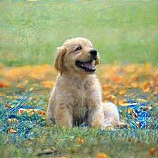
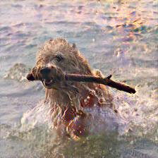
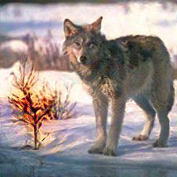

# Adversarial Examples Using Style Transfer

这个项目实现了将风格迁移与对抗样本生成相结合的方法，用于生成具有自然视觉效果的对抗样本。

## 结果展示
生成图片的预测标签以及详细损失保存在results/style_transfer_results.txt中，但是由于图片太大了，所以我压缩之后再上传了，
为了观察结果，请解压data_results.zip
以下是使用风格迁移生成的图片：

### 单独处理的图片(原图是小金毛，风格有四种，目标类别是电影院，下面四张图都是攻击成功的结果，具体数据可以看results/style_transfer_results.txt，

### 原图


### 结果（风格分别是dirty,snow,fire和VanGogh)




### last 文件夹中的图片 （风格是fire🔥，目标是电影院）







## 环境要求

- Python 3.8+
- PyTorch
- CUDA (推荐)

## 安装

1. 创建并激活虚拟环境（推荐使用 conda）：

   ```bash
   conda create -n adv_style_transfer python=3.8
   conda activate adv_style_transfer
   ```

2. 克隆项目并安装依赖：

   ```bash
   git clone https://github.com/your_username/adv_style_transfer.git
   cd adv_style_transfer
   pip install -r requirements.txt
   ```

## 使用方法

1. 将内容图片（jpg）放入 `data/content_images/` 文件夹（没有可以创建）。
2. 将风格图片（jpg）放入 `data/style_images/` 文件夹。
3. 运行风格迁移脚本：你可以根据自己的需要改变下面命令的参数

   ```bash
   python test_style_transfer.py --content_image "your_content_image" --style_image "your_style_image" --num_steps 2000 --content_weight 3 --style_weight 2e4 --adv_weight 3 
   ```

4. 结果将保存在 `results/` 文件夹中。

## 参数说明

- `--content_image`: 内容图片名称 (默认: dog)
- `--style_image`: 风格图片名称 (默认: fire)
- `--num_steps`: 训练迭代次数 (默认: 2000)
- `--content_weight`: 内容损失权重 (默认: 3)
- `--style_weight`: 风格损失权重 (默认: 2e4)
- `--adv_weight`: 对抗损失权重 (默认: 3)
- `--loop`: 是否处理 `data/content_images/last` 文件夹下的所有图片

## 备注
如果你希望用tensorBoard查看训练时损失，将models/style_transfer.py中的相关备注代码取消备注，并在环境中安装tensorflow就可以看啦！

## 贡献

欢迎提交问题和贡献代码！
