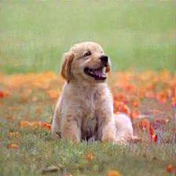
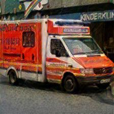
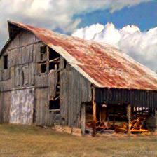
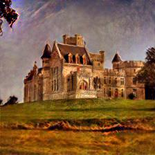
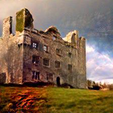
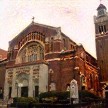
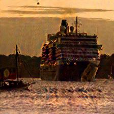

# Adversarial Examples Using Style Transfer

这个项目实现了将风格迁移与对抗样本生成相结合的方法，用于生成具有自然视觉效果的对抗样本。

## 环境要求

- Python 3.8+
- PyTorch
- CUDA (推荐)

## 安装

1. 创建并激活虚拟环境（推荐使用 conda）：

   ```bash
   conda create -n adv_style_transfer python=3.8
   conda activate adv_style_transfer
   ```

2. 克隆项目并安装依赖：

   ```bash
   git clone https://github.com/your_username/adv_style_transfer.git
   cd adv_style_transfer
   pip install -r requirements.txt
   ```

## 使用方法

1. 将内容图片（jpg）放入 `data/content_images/` 文件夹。
2. 将风格图片（jpg）放入 `data/style_images/` 文件夹。
3. 运行风格迁移脚本：

   ```bash
   python test_style_transfer.py --content_image "your_content_image" --style_image "your_style_image" --num_steps 2000 --content_weight 3 --style_weight 2e4 --adv_weight 3 
   ```

4. 结果将保存在 `results/` 文件夹中。

## 参数说明

- `--content_image`: 内容图片名称 (默认: dog)
- `--style_image`: 风格图片名称 (默认: fire)
- `--num_steps`: 训练迭代次数 (默认: 2000)
- `--content_weight`: 内容损失权重 (默认: 3)
- `--style_weight`: 风格损失权重 (默认: 2e4)
- `--adv_weight`: 对抗损失权重 (默认: 3)
- `--loop`: 是否处理 `data/content_images/last` 文件夹下的所有图片

## 结果展示
生成图片的预测标签以及详细损失保存在results/style_transfer_results.txt中。
以下是使用风格迁移生成的图片：

### 单独处理的图片



### last 文件夹中的图片










## 贡献

欢迎提交问题和贡献代码！